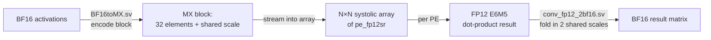

# KSIP-MODELS — MX-Format Systolic Array with an FP12 Stochastic-Rounding Accumulator

A hardware design + verification project from the **ACCL lab at KAUST**. The
goal is a matrix-multiply engine for a RISC-V coprocessor that works directly on
**Microscaling (MX)** minifloat data, using a novel per-PE accumulator: a
**12-bit floating-point accumulator with eager stochastic rounding (SR)**.

Everything here is written in SystemVerilog, simulated with **Verilator**, and
checked bit-for-bit against **Python golden models** derived from Microsoft's
[microxcaling](https://github.com/microsoft/microxcaling) reference library.

> **New to the project? Read this file top to bottom.** It assumes no prior
> knowledge of MX, systolic arrays, or stochastic rounding, and builds up to the
> full design one concept at a time.

---

## Table of contents

1. [The problem in one paragraph](#1-the-problem-in-one-paragraph)
2. [Background: what MX format is and why it exists](#2-background-what-mx-format-is-and-why-it-exists)
3. [Background: systolic arrays for matrix multiply](#3-background-systolic-arrays-for-matrix-multiply)
4. [The core design question: which accumulator?](#4-the-core-design-question-which-accumulator)
5. [End-to-end dataflow](#5-end-to-end-dataflow)
6. [The FP12 stochastic-rounding accumulator, in depth](#6-the-fp12-stochastic-rounding-accumulator-in-depth)
7. [The processing element (PE)](#7-the-processing-element-pe)
8. [The systolic array top](#8-the-systolic-array-top)
9. [Output conversion back to BF16](#9-output-conversion-back-to-bf16)
10. [Verification methodology](#10-verification-methodology)
11. [Repository layout](#11-repository-layout)
12. [How to build and run](#12-how-to-build-and-run)
13. [Design decisions at a glance](#13-design-decisions-at-a-glance)
14. [Glossary](#14-glossary)
15. [Status](#15-status)

---

## 1. The problem in one paragraph

Modern deep-learning accelerators want to store weights and activations in
**very narrow number formats** (8 bits or fewer) to save memory and bandwidth,
but still compute accurate dot products. **MX (Microscaling)** is one such
format: it groups numbers into blocks that share a single scale factor. To
multiply two MX matrices you need a systolic array of multiply-accumulate (MAC)
units. The multiply is easy; the **accumulation** is the hard part, because
adding up many tiny products in a narrow float silently loses the small terms
("swamping"). This project builds that array and, crucially, solves the
accumulation problem with a **12-bit float accumulator that uses stochastic
rounding** to keep the error zero-mean instead of one-directional.

---

## 2. Background: what MX format is and why it exists

A normal floating-point number carries its own exponent. If you have 32 numbers,
you store 32 exponents. **MX format factors out a shared exponent per block:**

```
MX block (k = 32 elements):
  ┌─────────────┐   ┌──────┬──────┬──────┬─── ... ───┬──────┐
  │ shared scale │   │ el 0 │ el 1 │ el 2 │           │ el31 │
  │  (E8M0, 8b)  │   │      │      │      │           │      │
  └─────────────┘   └──────┴──────┴──────┴─── ... ───┴──────┘
     one per block        k narrow minifloat elements
```

- The **shared scale** is an 8-bit power-of-two exponent (format **E8M0** — 8
  exponent bits, 0 mantissa bits, biased by 127). It is the block's overall
  magnitude.
- Each **element** is a tiny floating-point value (a "minifloat") whose real
  value is `element × 2^(shared_scale − 127)`.

The reference value of element *i* in a block is therefore
`(−1)^sign · 1.mantissa · 2^(element_exp − element_bias) · 2^(shared_scale − 127)`.

This project supports the four MX minifloat element formats used by the ACCL
lab. Each element occupies `1 + exp_width + man_width` bits:

| Name        | `exp_width` | `man_width` | bits | element bias = 2^(exp_width−1)−1 |
|-------------|:-----------:|:-----------:|:----:|:-------------------------------:|
| MXFP8 E5M2  | 5           | 2           | 8    | 15                              |
| MXFP8 E4M3  | 4           | 3           | 8    | 7                               |
| MXFP6 E3M2  | 3           | 2           | 6    | 3                               |
| MXFP6 E2M3  | 2           | 3           | 6    | 1                               |

The whole design is **parameterized on `exp_width` and `man_width`**, so the same
RTL elaborates to any of these formats.

**Getting into MX:** raw activations arrive as **BF16** (the 16-bit "brain
float"). The encoder [`BF16toMX.sv`](BF16toMX.sv) turns a block of 32 BF16 values
into one MX block: it finds the block's maximum exponent, derives the shared
scale, then re-encodes each element relative to that scale with round-to-even.
This encoder is complete and was verified end-to-end against a microxcaling-based
golden ([`golden-model.py`](golden-model.py)) before any of the accumulator work
began.

---

## 3. Background: systolic arrays for matrix multiply

A **systolic array** computes `C = A × B` by streaming the rows of A in from the
**west** (left) edge and the columns of B in from the **north** (top) edge of a
2-D grid of PEs. Data marches rightward and downward one hop per clock. PE[i][j]
sits at the intersection of row *i* and column *j*, so over time it sees every
`(A[i][t], B[t][j])` pair and accumulates their products into `C[i][j]`.

```
                 north (columns of B)
                 ┌────┬────┬────┬────┐
        west  →  │PE00│PE01│PE02│PE03│
    (rows of A)  ├────┼────┼────┼────┤
              →  │PE10│PE11│PE12│PE13│
              →  │PE20│PE21│PE22│PE23│
              →  │PE30│PE31│PE32│PE33│
                 └────┴────┴────┴────┘
   each PE[i][j] accumulates the dot product of row i and column j
```

Because data ripples across the fabric, **row/column feeds must be staggered**:
element *n* of row *i* and element *n* of column *j* must arrive at PE[i][j] on
the *same* cycle. In this design each PE adds **3 cycles** of pass-through
latency, so row *i* / column *j* is delayed by `3·i` / `3·j` cycles at the edge.
This 3-cycle-per-hop stagger becomes important in the accumulator design — see
§6.5.

---

## 4. The core design question: which accumulator?

Each PE must reduce up to `k = 32` products into one running sum. Two accumulator
families were on the table:

- **Kulisch / wide fixed-point** — accumulate into a very wide fixed-point
  register (~30–40 bits for E4M3, k=32). **Exact**, no rounding inside the array,
  but the register is large per PE.
- **Narrow floating-point (BF16 / FP12)** — cheaper per PE, but a long running
  sum in a narrow float suffers **swamping**: when you compute `S + t` and `t` is
  much smaller than one unit-in-the-last-place of `S`, ordinary
  round-to-nearest-even (RNE) collapses `S + t` back to `S`, silently discarding
  `t`. Over a long dot product this bias accumulates as **O(N)** error.

This repository ships all three accumulator families (the upstream ACCL repo
provides **Exact** and **BF16**; this work adds **FP12-SR**). The design chosen
and built out here is:

> **FP12 E6M5 accumulator with *eager stochastic rounding*, r = 13 random bits,
> subnormals off, living inside each PE (weight-stationary).**

**Why stochastic rounding beats RNE here:** instead of always rounding `S + t`
the same way, SR rounds up with a probability equal to how close the true result
is to the upper grid point. The rounding error becomes **zero-mean**, so the
total error of a length-N reduction grows as **O(√N)** instead of O(N). The tiny
terms that RNE throws away are, on average, preserved. This follows Ben Ali et
al. ([arXiv:2404.14010](https://arxiv.org/abs/2404.14010)), whose FP8×FP8 → FP12
SR MAC reaches near-FP32 accuracy at roughly half the area/energy of an FP16 MAC.

FP12 was chosen over BF16 (simpler, but larger and no SR study behind it) and
over Kulisch (exact, but a wide register per PE and no rounding-research payoff)
as the most area/energy-efficient point that still hits near-baseline accuracy.

---

## 5. End-to-end dataflow



Inside a single PE, one *element pair* travels this pipeline:

```
 MX code (west)  ──┐
 MX code (north) ──┤
                   ▼
   S1  decode  (split sign/exp/mant, Sub-OFF denormal flush)
                   ▼
   S2  multiply (exact mantissa product, no rounding)
                   ▼
   S3  bridge   (mx_product_to_fp_operand: normalize product → FP12-ish operand)
                   ▼
   S4–S9  eager-SR adder (accumulate into a lane register)   ← the heart of the design
                   ▼
   combine tree (reduce the 7 lane registers → 1 final FP12 value)
                   ▼
   result: FP12 (sign, exp[5:0], mant[4:0])
```

The multiply is **exact** — all rounding in the entire datapath happens in the SR
adder (S4–S9) and its small second-stage trim (S9). That is a deliberate
property from the paper: keep one, well-understood rounding site.

---

## 6. The FP12 stochastic-rounding accumulator, in depth

### 6.1 The accumulator number format: FP12 E6M5

The running sum in each lane is a 12-bit float:

```
 FP12 E6M5:   [ sign : 1 ][ exponent : 6 (biased 31) ][ mantissa : 5 explicit ]
 significand precision p = 6  (1 hidden bit + 5 explicit)
```

`exp == 0` means **exact zero** (there are no subnormals — see "Sub-OFF" below).
The exponent field is 6 bits so a single product can't overflow FP12's range
before the accumulation even begins; the true overflow guard fires post-add in
S9.

### 6.2 S3 — the bridge stage ([`mx_product_to_fp_operand.sv`](mx-systolic-fpga/src/fp12sr_accum/mx_product_to_fp_operand.sv))

Ben Ali's adder assumes it is handed normalized floating operands. But S2 hands
us a raw **mantissa-only product**. S3 is the glue that isn't a numbered block in
the paper — it produces the operand the adder consumes:

- **Mantissa normalization without a shifter.** Two operand mantissas are each in
  [1, 2), so their product is in [1, 4). A single bit-select (not a barrel shift)
  picks the aligned fraction with **zero precision loss**:
  - `shift_bit = product[2M+1]`. If set, the product was in [2, 4): take
    `product[2M:0]`. Otherwise take `{product[2M−1:0], 1'b0}`.
  - The resulting `frac` is `CW = 2·man_width + 1` bits wide — **wider than
    FP12's 5-bit mantissa** for `man_width = 3` formats. Those extra bits are
    genuine product precision, fed into the adder's sticky-round stage rather
    than thrown away.
- **Exponent fusion.** The two per-element biased exponents are combined straight
  into FP12's bias (31), folding both format-bias removals and FP12's bias into
  one per-format constant `exp_adjust = 33 − 2^exp_width`, plus `shift_bit`. A
  defensive saturating clamp guards the FP12 exponent ceiling.

The two key derived widths used everywhere downstream:

| Symbol | Meaning                                  | `man_width=2` | `man_width=3` |
|--------|------------------------------------------|:-------------:|:-------------:|
| `CW`   | S3 fraction width = `2·man_width + 1`     | 5             | 7             |
| `EXTRA`| real precision beyond FP12's mantissa = `CW − 5` | 0     | 2             |

### 6.3 Why "eager" stochastic rounding

The mechanism of SR is elegant: **add uniform random bits to the tail of the
number and check whether they carry into the round position.** That is
arithmetically identical to comparing the discarded tail against a uniform random
threshold — so the round-up probability naturally equals the fractional distance
to the upper grid point. **No divider, no comparator, no explicit probability** —
it falls out of an adder.

The design uses **r = 13 random bits** per add. The paper shows r = 13 matches
the FP32 accuracy baseline, while r = 4 collapses it (43% vs 91% on
ResNet20/CIFAR10). r = 13 costs only modestly more than r = 9.

**"Eager" vs "lazy":** lazy SR adds the random bits *after* normalization, which
forces the leading-zero-detect and normalization blocks to be `p + r ≈ 19` bits
wide. Eager SR computes **both possible random carries speculatively, in
parallel** with normalization, so those blocks stay `p + 1 ≈ 7` bits wide. The
speculation costs ~20 gates; the payoff is ~27% latency and ~19% area vs lazy.

### 6.4 The eager-SR adder pipeline ([`sr_adder_fp12.sv`](mx-systolic-fpga/src/fp12sr_accum/sr_adder_fp12.sv))

Six register stages (recurrence latency **L = 6**), one per Ben-Ali block group.
Operand **A** is the current lane register (an FP12 value); operand **B** is the
S3 product operand; `rand_in` is one 13-bit LFSR draw.

| Stage | Ben-Ali block(s) | What it does |
|-------|------------------|--------------|
| **S4** | 1 — Exp diff / Swap | Magnitude-compare A and B, call the larger **X**, smaller **Y**. Emit the shift amount `X.exp − Y.exp`, the effective add/sub flag (`op_sub`), and the **close/far** path selector. |
| **S5** | 2/3 — Shift, 2's-comp | Right-shift Y's significand into a `(CW+1)+11`-bit register (mantissa + guard + deep tail). Conditionally negate for subtraction *after* the shift (avoids sign-extension mess). |
| **S6** | 4/5/6 — Fanout, Main add, Sticky Round | The main `(CW+2)`-bit sum `X + Y_main` runs in parallel with the **sticky round**: add Y's shifted-off tail (`TAIL_W = r−2 = 11` bits) to 11 PRNG bits and keep the top two carry candidates `s1`, `s2` (for the no-shift vs shift normalization outcomes). |
| **S7** | 7 — LZD/Shift ∥ Normalize | **Close path** (effective subtract, shift ≤ 1): count leading zeros and left-shift (cancellation), forcing the random carry to 0. **Far path**: 0- or 1-bit right-shift; pick `s2` if the sum carried out, else `s1`. Both computed in parallel; the close/far mux picks. |
| **S8** | 8/9 — Trapezoid mux + Round Correction | Apply the selected speculative carry to the normalized significand; re-normalize once more if that carry overflowed. |
| **S9** | 10 — Second-stage trim + Increment | Trim the `(CW+1)`-bit corrected significand down to FP12's native 5-bit mantissa. For `man_width=3` (EXTRA=2) this consumes the **2 leftover LFSR bits** (13 − 11) as a second genuine SR round-off — every drawn bit is used. Then the final overflow/underflow clamp (**Sub-OFF**: underflow flushes to true zero, overflow saturates to max FP12). |

**Sub-OFF (no subnormals):** denormal operands are flushed to 0 at decode, and
adder underflow flushes to true zero rather than producing a subnormal. This
drops a pile of special-case alignment logic; the accuracy hit at r = 13 is
negligible and it saves ~4–5% area.

The **critical path** is `main-add → LZD/Shift or Normalize → trapezoid mux →
round correction → increment`. The sticky-round and PRNG paths are never on it.

### 6.5 The PRNG — and the one subtle bug that mattered ([`lfsr_galois.sv`](mx-systolic-fpga/src/fp12sr_accum/lfsr_galois.sv))

Each PE has its own **13-bit Galois LFSR**, polynomial `x¹³ + x⁴ + x³ + x¹ + 1`
(taps {13,4,3,1}, mask `0x100D`, a maximal-length polynomial from Xilinx
XAPP052). It is uniquely seeded per PE (`(SEED_BASE ^ pe_id) | 1`, guaranteeing
nonzero) so no two PEs share a random stream.

> **⚠ The critical design rule: the LFSR must be *dispatch-gated*, not
> free-running.** `enable = adder_valid_in`, so the LFSR advances **exactly once
> per add issued** to the shared adder.

Why this matters: if the LFSR free-ran (`enable = 1`), which random draw an add
consumes would depend on **absolute cycle time**. But the systolic stagger (§3)
means PE[i][j]'s data arrives `3·(i+j)` cycles late — so a free-running PRNG would
hand every off-diagonal PE a *differently phased* draw sequence than a golden
model that assumes each PE starts at cycle 1. That is exactly the bug that was
found and fixed: 35 of 64 array results mismatched, each off by one low-order
mantissa bit (the SR fingerprint). Gating the LFSR on dispatch makes draw index
track **local dispatch order** — intake element *i* consumes draw *i*, combine
step *j* consumes draw *k+j* — so **each PE is a pure function of its own local
element stream**, identical at any array position behind any stagger or feed gap.
This is what lets a single block-level golden replay verify every PE.

---

## 7. The processing element (PE) ([`pe_fp12sr.sv`](mx-systolic-fpga/src/fp12sr_accum/pe_fp12sr.sv))

The PE glues everything together around **one shared, time-multiplexed
`sr_adder_fp12`** (there is only one adder, not 32) plus a small register file.

### 7.1 Lane register file and round-robin dispatch

A dot product of length k is reduced across a **7-entry lane register file**.
Intake element *i* is dispatched into lane `i % 7`. Why 7?

> **`NUM_LANES = 7 = L + 1`.** The adder has 6 register stages, so an add issued
> at posedge *n* produces its result at posedge *n+5*. Writing that result back
> into a lane register is **itself** a 7th synchronous stage, so a lane isn't
> safely reusable until posedge *n+7*. With one dispatch per cycle, consecutive
> same-lane dispatches are exactly `NUM_LANES` cycles apart — so `NUM_LANES ≥ 7`.

This corrects a margin caveat the original plan had flagged (it guessed 6 might
suffice). A 6-stage **tag pipeline** carries each dispatch's destination lane
alongside the adder so the write lands in the right lane.

### 7.2 Combine-tree FSM

Once all k elements have landed, the 7 partial sums in the lanes must be reduced
to one. A small FSM (`ST_INTAKE → ST_COMBINE_ISSUE → ST_COMBINE_WAIT → ST_DONE`)
issues 6 **serial** adds (lane[0] += lane[1..6]), each **waiting for the previous
add's `valid_out`** before issuing the next — because each combine add depends on
the actual result of the one before it, not merely on lane reuse. The final add
pulses `result_valid` for one cycle and latches the final FP12 result.

### 7.3 Systolic pass-through

Independently of all the accumulation, the PE forwards its west input to its east
output and its north input to its south output through a **3-deep register
pipeline** (`data_right/bottom_s1..s3`). That 3-cycle depth is the per-hop
latency the array stagger is built around (§3, §8).

---

## 8. The systolic array top ([`top_fp12sr_systolic_mx.sv`](mx-systolic-fpga/src/fp12sr_accum/top_fp12sr_systolic_mx.sv))

An `N×N` generate-grid of `pe_fp12sr`, wired west→east and north→south, each PE's
result fed through a `conv_fp12_2bf16`. Each PE gets `pe_id = i·N + j` (its unique
LFSR seed offset).

**Completion signal.** The exact/BF16 designs AND together level-valued
pass-through valids at the corner. This design can't: `pe_fp12sr.result_valid` is
a single-cycle **pulse**. But because every PE has identical internal latency once
its own local element 0 arrives, and entry delay into PE[i][j] is the strictly
increasing `3·(i+j)`, the **bottom-right corner PE[N−1][N−1] always finishes
last**. Every other PE's result is already latched and stable (results hold, they
aren't cleared after the pulse) by the time the corner fires. So
`result_valid_out` is simply the corner PE's pulse — no AND tree needed.

---

## 9. Output conversion back to BF16 ([`conv_fp12_2bf16.sv`](mx-systolic-fpga/src/fp12sr_accum/conv_fp12_2bf16.sv))

Each PE's FP12 E6M5 result is widened to BF16, folding in the block's **two shared
MX scale codes** (the row's and the column's, both E8M0 biased 127). Because the
FP12 input is already normalized, this is pure exponent arithmetic — no CLZ, no
renormalize:

```
 bf16_biased_exp = fp12_exp + shared_scale_row + shared_scale_col − 158
 bf16_mantissa   = { fp12_mant, 2'b00 }        (5 bits → 7, zero-padded)
 (exp_in == 0  ⇒  exact zero out)
```

The constant −158 = 127 (add BF16 bias) − 31 (remove FP12 bias) − 127 − 127
(remove the two E8M0 scale biases). There is **no MX re-quantization on the
output** — the array emits BF16/FP32-range values, a deliberate project decision.

---

## 10. Verification methodology

Every RTL module has a **bit-exact Python twin** in
[`fp12sr_golden.py`](fp12sr_golden.py), and a **self-checking Verilator
testbench** that compares RTL output to golden hex vectors with 4-state `!==`
compares. The models were built and verified **bottom-up** — a stage is only
trusted once its own testbench is green, then it becomes a building block for the
next:

| Golden section | RTL module | Testbench | What it covers |
|----------------|-----------|-----------|----------------|
| §4a PRNG | `lfsr_galois.sv` | `lfsr_galois_tb` | 257 cycles of the Galois sequence |
| §S3 bridge | `mx_product_to_fp_operand.sv` | `mx_product_to_fp_operand_tb` | product → normalized operand, incl. zero-product |
| §S4–S9 adder | `sr_adder_fp12.sv` | `sr_adder_fp12_tb` | eager-SR add: cancellation, close/far path, saturate |
| §conv | `conv_fp12_2bf16.sv` | `conv_fp12_2bf16_tb` | FP12 → BF16 with scale folding |
| §4c single-PE | `pe_fp12sr.sv` | `pe_fp12sr_single_block_tb` | one full 32-element block through one PE |
| §4d full array | `top_fp12sr_systolic_mx.sv` | `4x4_systolic_array_fp12sr_MX_tb` | 4×4 array, all four MX formats |

**Guiding principles (carried over from the BF16toMX work):**

- The golden model uses microxcaling's `round='even'`, **not** `round='nearest'`
  — microxcaling's "nearest" is round-half-*away*-from-zero, not RNE.
- Vectors are `$readmemh`-safe flat hex (bare tokens, one per line), one file per
  port, with a human-readable `.meta.txt` sidecar per target.
- **Every mismatch is *either* an RTL bug *or* a golden-model bug.** The reflex to
  blame the RTL first is a trap — the dispatch-gating fix (§6.5) was a case where
  *both* the RTL (free-running LFSR) and the golden (cycle-accurate timing model)
  were wrong in mirror-image ways.
- Because the PE is a pure function of its local element stream (§6.5), the array
  golden needs **no cycle-accurate modeling** — it replays each PE with the same
  `pe_fp12sr_single_block` used at the single-PE level. Systolic-stagger timing
  correctness is entirely the RTL testbench's job.

---

## 11. Repository layout

```
KSIP-MODELS/
├─ README.md                     ← this file
├─ log.md                        ← running decision log
├─ CLAUDE.md                     ← design notes / working agreement
│
├─ BF16toMX.sv                   ← BF16 → MX block encoder (front-end, verified)
├─ tb_MXBF16toMX.sv              ← encoder testbench
├─ golden-model.py              ← microxcaling golden for the encoder/decoder
├─ fp12sr_golden.py             ← bit-exact golden for the whole FP12-SR path
│
├─ microxcaling/                 ← Microsoft MX reference library (submodule/vendor)
│
└─ mx-systolic-fpga/             ← the systolic-array RTL (ACCL lab base + this work)
   ├─ src/
   │  ├─ exact_accum/            ← wide-Kulisch exact accumulator (upstream)
   │  ├─ bf16_accum/             ← BF16 accumulator (upstream)
   │  └─ fp12sr_accum/           ← ★ this project's FP12 eager-SR accumulator
   │     ├─ lfsr_galois.sv
   │     ├─ mx_product_to_fp_operand.sv
   │     ├─ sr_adder_fp12.sv
   │     ├─ pe_fp12sr.sv
   │     ├─ conv_fp12_2bf16.sv
   │     └─ top_fp12sr_systolic_mx.sv
   └─ tb/
      └─ fp12sr_tb/              ← the six testbenches + generated *.hex vectors
```

The `exact_accum/` and `bf16_accum/` folders are the upstream ACCL reference
accumulators (each with 1–4 pipeline-stage PE variants); the FP12-SR work reuses
their decode/multiply front-end (`pe_exact_4s.sv` stages 1–2) and their array
wiring pattern, swapping in the SR accumulator.

---

## 12. How to build and run

**Dependencies.** [Verilator](https://verilator.org) ≥ 5.05 and Python 3. The
FP12-SR golden model (`fp12sr_golden.py`) uses **only the Python standard
library** — nothing to install for the main design path. The *legacy encoder*
golden (`golden-model.py`) additionally needs PyTorch and Microsoft's
[microxcaling](https://github.com/microsoft/microxcaling) reference library,
which is **not vendored here** (see `requirements.txt` and `NOTICE`):

```bash
pip install -r requirements.txt
git clone https://github.com/microsoft/microxcaling   # for the encoder golden only
```

The generated `.hex` / `.meta.txt` test vectors are **not committed** (they are
reproducible artifacts). Regenerate them before running any testbench.

**1. Generate the golden vectors** (writes hex + meta files into `tb/fp12sr_tb/`):

```bash
python3 fp12sr_golden.py
```

**2. Build and run a testbench** (from `mx-systolic-fpga/tb/fp12sr_tb/`). The
full array TB, which exercises all four formats:

```bash
cd mx-systolic-fpga/tb/fp12sr_tb
rm -rf obj_dir
verilator --binary --timing -Wall \
  --Wno-WIDTHEXPAND --Wno-WIDTHTRUNC --Wno-GENUNNAMED --Wno-DECLFILENAME \
  --Wno-UNUSEDPARAM --Wno-BLKSEQ --Wno-UNUSEDSIGNAL --Wno-PINCONNECTEMPTY \
  -j 0 --top-module top_fp12sr_array_tb \
  ../../src/exact_accum/clz.sv \
  ../../src/fp12sr_accum/lfsr_galois.sv \
  ../../src/fp12sr_accum/mx_product_to_fp_operand.sv \
  ../../src/fp12sr_accum/sr_adder_fp12.sv \
  ../../src/fp12sr_accum/pe_fp12sr.sv \
  ../../src/fp12sr_accum/conv_fp12_2bf16.sv \
  ../../src/fp12sr_accum/top_fp12sr_systolic_mx.sv \
  4x4_systolic_array_fp12sr_MX_tb.sv -o top_fp12sr_array_tb
./obj_dir/top_fp12sr_array_tb
```

Expected tail:

```
=== ALL TESTS PASSED (4 formats x 4 x 4 array) ===
```

The other five testbenches follow the same pattern with their own source list and
`--top-module`. Note the shared `obj_dir/` — nuke it between builds. `clz.sv` is
only needed by the array TB (pulled in via the reused front-end).

---

## 13. Design decisions at a glance

| Axis | Decision | Rationale |
|------|----------|-----------|
| Accumulator numeric type | **FP12 E6M5** | Most area/energy-efficient point at near-baseline accuracy (Ben Ali et al.) |
| Rounding policy | **Eager stochastic rounding, r = 13** | Zero-mean error → O(√N) not O(N); eager keeps normalize blocks narrow |
| Subnormals | **Sub-OFF** (flush to zero) | Drops special-case logic, ~5% area, negligible accuracy loss at r=13 |
| Accumulator placement | **Inside each PE** (weight-stationary) | One shared time-mux'd adder + 7-lane register file per PE |
| Reduction structure | **7-lane round-robin intake → serial valid-gated combine tree** | `NUM_LANES = L+1 = 7` from the lane-reuse-gap analysis |
| PRNG | **Per-PE 13-bit Galois LFSR, dispatch-gated** | Makes each PE position-independent; unblocks single-golden verification |
| Output | **BF16, no MX re-quant** | Array emits full-range results; scales folded in at conversion |

---

## 14. Glossary

- **MX / Microscaling** — a numeric format where a block of *k* narrow minifloats
  shares one power-of-two scale factor.
- **BF16** — 16-bit "brain float": 1 sign, 8 exponent, 7 mantissa bits.
- **E*x*M*y*** — a float with *x* exponent bits and *y* mantissa bits (e.g. E4M3).
  **E8M0** is the shared-scale format (8 exp, 0 mant = a pure power of two).
- **FP12 E6M5** — the 12-bit accumulator format: 1 sign, 6 exponent (bias 31), 5
  mantissa.
- **Swamping** — loss of a small addend when `|t| ≪ ulp(S)` in `S + t` under RNE.
- **RNE** — round to nearest, ties to even (IEEE default).
- **SR** — stochastic rounding: round up with probability = fractional distance to
  the upper grid point.
- **LFSR** — linear-feedback shift register; a cheap hardware pseudo-random
  generator.
- **Kulisch accumulator** — a very wide fixed-point register that makes a float
  dot product exact.
- **PE** — processing element: one MAC cell of the systolic array.
- **Systolic stagger** — the per-row/column feed delay that aligns operands at
  each PE (here 3 cycles per hop).
- **`k`** — MX block size / dot-product length (32 here).
- **`CW` / `EXTRA`** — S3 fraction width (`2·man_width+1`) / its excess over FP12's
  5-bit mantissa.

---

## 15. Status

The **FP12 eager-SR accumulator path is complete and bit-exact** against the
golden model on Verilator, across all four target MX formats (E5M2, E4M3, E3M2,
E2M3). All six testbenches pass: LFSR, S3 bridge, SR adder, FP12→BF16 conversion,
single-PE block, and the full 4×4 array.

The BF16→MX encoder front-end (`BF16toMX.sv`) was verified earlier against its own
microxcaling golden.

**Reference reading** (in the order it was used): the ACCL lab's own
`mx-systolic-fpga` exact/BF16 variants; Ben Ali et al.
[arXiv:2404.14010](https://arxiv.org/abs/2404.14010) (FP8 multiplier + FP12 SR
accumulator) and the expanded PhD thesis (HAL tel-05452584); Wang et al.
[arXiv:1812.08011](https://arxiv.org/abs/1812.08011) (chunked accumulation);
Uguen & de Dinechin (HAL hal-01488916v2) on Kulisch design space.
